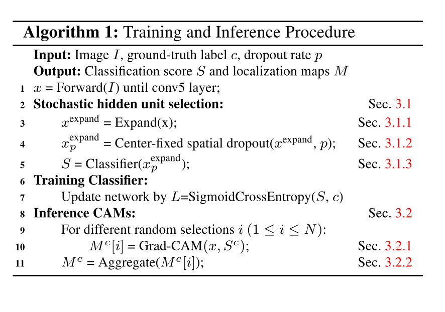
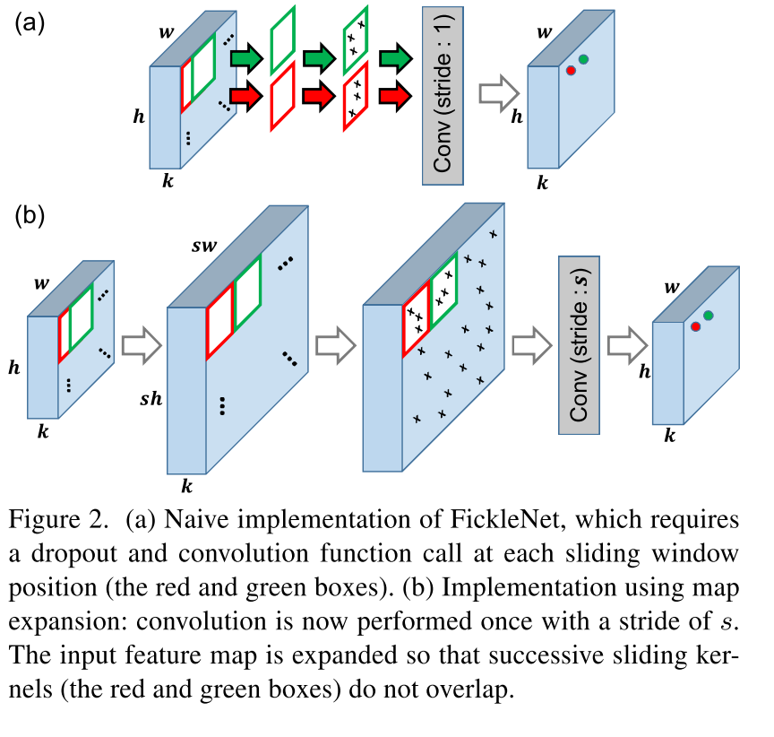

[TOC]

#FickleNet: Weakly and Semi-supervised Semantic Image Segmentation using Stochastic Inference

## 问题/启发/注意点

1. 特征图膨胀方式不明
2. 特征图膨胀需要更多的GPU memory
3. 分割伪标签+分类损失

## 总结

通过随机选择隐层单元生多不同的CAM，聚合后作为分割网络的伪标签

联系了非显著区域和显著区域，缓解了之前研究中只聚焦在显著区域的问题

简单有效

## 摘要

弱监督语义分割的难点在于从图像级别的标注中获取像素级别的信息。大部分方法基于图像级别的标注并使用分类器来获取定位图，但是这些方法的缺陷在于只能聚焦在小的差异，无法获取精确的分割边界。

FickleNet探索了feature maps的各种定位组合。随机选取隐层单元然后使用它们获取激活值用于图像分类。FickleNet隐式地学到了特征图中每个定位的连贯性，从而得到同时识别了明显区域和物体其他位置的定位图。这个集成效果在一个单一网络中通过随机选择隐层单元对得到的。

这个方法不需要额外的训练只是在标准卷积网络中添加了一个简单的layer。在弱监督和半监督任务中Pascal VOC 2012 benchmark性能超过了最近的方法。

## 论文主要贡献

1. 提出FickleNet，简单地使用dropout思想实现，探索一张图中位置的关系和扩充了分类器的激活域
2. 提出了一个扩展特征图的方法来加速本文算法，并只使用少量GPU mempry

3. Pascal VOC 2012 benchmark上SOTA 弱监督、半监督

## 提出的方法

1. FickleNet，随机选择隐层单元，该网络用于多分类任务
2. 为训练图片生成定位图
3. 使用伪标签训练分割网络

### 隐层单元随机选择

随机隐层单元的目的在于挖掘目标各部分（部件）之间的关系（通过随机选的隐层单元对计算分类分数），把同一个物体不显著区域和显著区域联系起来。

通过在特征$$x$$上的每一个滑窗上应用空间随机失活（spatial dropout）实现Fig 2(a)。这与标准的dropout不同，在前向传播中，在只采样特征图中的隐层单元，那些没有被采样到的隐层单元不对class score做出贡献。本文方法在每个滑窗的位置采样，意味着一个隐层单元可能在一些滑动窗口中激活在另一些滑动窗口中失活。

这种随机选择隐层单元单元的方法可以生成很多不同形状和大小的感受野，Fig 3. 一些可能与空洞卷积相似，可以预期包含了不同rate的空洞卷积。

### 特征图膨胀

本文方法需要在每一个滑窗的位置进行采样，无法直接使用现在的深度学习框架提供的CUDA-level的卷积。如果直接使用Fig 2(a)中的方法，不得不在每一次的前传中调用$$w*h $$倍的卷积和dropout方法。通过膨胀特征图降低到一次前传只调用一次方法。

Fig 2(b)展示了膨胀输入的特征图来**达到滑动窗口没有重叠**。在膨胀特征图前进行zero padding，目的是使的输入输出的大小一致。特征图在zero padding后的大小是$$k*(h+s-1)*(w+s-1)$$，$$s$$是卷积核大小。膨胀zero-padded 的特征图为了连续的滑窗没有重叠区域，$$x^{expand}$$的大小是$$k*(sh)*(sw)$$（相当于原始h，w的特征图上的每一个点对应了现在的s*s的一块区域）。

我们使用保留中心的dropout技术采样$$x^{expand}$$，**尽管膨胀特征图需要更多的GPU memory**，但所训练的参数量保持不变，所以GPU的负载增加的并不是很明显。

### 保留中心的空间失活

通过在空间上应用dropout来实现隐层单元的随机选择。本文通过在膨胀的特征图上应用dropout和原始的实现达到一样的效果。需要注意的是dropout在所有通道上均匀使用。在每一个滑窗卷积核中心的不失活，目的是kernel中心和其他位置的关系可以被找到，以概率p空间失活后的特征图称为$$x^{expand}_{p}$$。尽管dropout通常是在训练时应用，**但本文在训练和推断过程中都使用**。

### 分类

为了获得分类分数，大小为$$s$$步长为$$s$$的卷积核应用于膨胀失活后的特征图$$x^{expand}_{p}$$。然后得到输出特征图大小为$$c*w*h$$，其中$$c$$是目标的类别数。在输出特征图上应用全局平均池化(特征图大小$$1*c$$)和sigmoid激活函数得到类别分数$$S$$。然后使用sigmoid cross-entropy 损失函数来更新FickleNet（softmax）

## 推断定位图

现在可以从一张图片中获取各种各样的类别分数，随机选择的隐层单元组合，每一个组合生成一个不一样的定位图。

### Grad-CAM

本文使用了基于梯度的CAM（Grad-CAM），用于生成类别激活图来获取定位图。Grad-CAM 从梯度流中挖掘了每一个隐层单元对类别分数的特定贡献。对目标类别分数计算对膨胀前的特征图x的梯度，在通道方向以梯度为权重求和。每一个目标类别的计算方式：

$$Grad-CAM^{c}=ReLU(\sum_{k}{x_{k}}*\frac{\partial S^{c}}{\partial x_{k}})$$

其中$$x_{k}\in \R^{w*h}$$是$$x$$中第$$k^{th}$$个通道的特征图，$$S^{c}$$是类别c的类别分数

### 定位图聚合

因为隐层单元不同的组合，FickleNet可以从一张图中获取了许多的定位图。本文从同一张图片的$$N$$张不同的定位图聚合为一张。$$M[i] (1\leq i\leq N)$$表示第$$i^{th}$$张随机选择的定位图。我们聚合N个定位图，使得如果在u的任何M [i]中的类c的激励得分高于阈值θ，则聚合地图中位于u的像素被分配给类c。 未分配给任何类的像素在训练阶段被忽略。如果一个像素被分配给多个类别，分配给平均图中的具有最高分数的类别

## 训练分割网络

定位图提供了伪标签来训练分割网络。本文使用了与**GSRG一样的背景线索（未读）**。将FickleNet生成的定位图输给DSRG作为种子线索来做弱监督的分割。

对于半监督学习，本文引入了一个额外的损失—人工完全标记的数据。$$C$$是图片中的类别集合。训练语义分割网络的损失函数：

$$L=L_{seed}+L_{boundary}+\alpha L_{full}$$

其中$$L_{seed}和L_{boundary}$$分别表示DSRG中的seeding loss和boundary loss。

$$L_{full}=-\frac {1}{\sum_{c\in C}{|F_{c}|}}\sum_{c\in C}\sum_{u \in F_{c}}{\log H_{u,c}}$$

其中$$H_{u,c}$$表示在分割图$$H$$中位置$$u$$处是类别$$c$$的概率，$$F_{c}$$是真值

## 实验

**Dataset**：PASCAL VOC 2012 image segmentation benchmark，20+1类，mIoU评价标准

**Network**：基于VGG-16，ImageNet预训练。网络修改：移除FC层和最后的pooling层，最后一个block中的卷积以rate为2的空洞卷积替换。kernel size $$s$$ 和dropout rate $$p$$ 分别设为9和0.9。性能超过了基于DeepLab-CRF-LargeFOV的DSRG

**细节**：

FickleNet：batch size —10；input size — 随机裁剪321x321；特征图大小 — 512x41x41（321/2->81;81/2->41）；初始lr — 0.001，每10个epochs减半；Adam 默认设置；

分割：与GSRG相同的设置；

N — 200；$$\theta$$ — 0.35；$$\alpha$$ — 2 (半监督)

