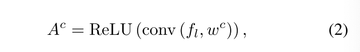

[TOC]

# Tell Me Where to Look: Guided Attention Inference Network

## 问题/注意点/启发

## 总结

## 摘要

仅使用粗标签的弱监督学习可以获得深度神经网络的视觉解释，例如通过反向传播梯度的注意力图。这些注意力图可以作为一些任务的先验知识，比如目标检测和语义分割。在一个常用的框架中我们克服了以前方法中对这些注意力图建模的三个缺陷：（1）我们第一次使用注意力图作为端到端训练的明确和自然的一部分；（2）通过直接提供自身引导挖掘监督信息来提升；（3）如果有额外的监督可用可以无缝连接

除了它的简单性，SOTA 在PASCAL VOC 2012。另外，提出的框架提供一种不仅解释了学习器的重心解释，而且向特定任务直接反馈引导信息。

即插即用来提升性能。

## 主要贡献

1. 在弱标记任务训练时直接使用注意力图来监督
2. 在训练阶段的自身监督策略来强制网络聚焦在整体目标而不是最有辨别力的区域
3. 将直接监督和自我指导相结合，从仅使用弱标签到在一个通用框架中使用全面监督进行无缝扩展

PASCAL VOC 2012 mIoU val 55.3%，test 56.8%

使用有限的像素级监督信息 mIoU 60.5%，62.1%

## 提出的方法-GAIN

由于注意力图反应了输入图像那块区域是支持网络预测的，我们提出guided attention inference networks（GAIN）来聚焦在监督注意力图当我们训练网络时。在这种方式下，网络的预测是基于我们期望网络聚焦的区域。我们通过使网络的注意力在端到端方式下可训练来实现，这在其他工作中还没有被考虑[11, 24, 28, 31, 36, 39]。

### self-guidence on the network attention

一个训练过的分类器的注意力图可以作为弱监督语义分割的先验知识。**然而，纯粹地通过分类损失来监督，注意力图经常只覆盖了感兴趣目标的具有辨别力的小区域**。这些注意力图可以为分割提供可靠的先验，但是一个更完整的注意力图确定地提升整体性能。

为了解决这个问题，我们的GAIN以自引导的正则化方式在注意力图上直接建立约束？？。如Fig 2所示，GAIN有两路网络分支，分类分支$S_{cl}$和注意力挖掘分支$S_{am}$，他们互相共享里权重。分类分支约束的目的的是找到能帮助识别类别的区域。注意力挖掘分支是确保所有对分类有用的区域都将被包含在网络的注意力中。在这种方式下，注意力图将变得更加完整、准确，更适合分割任务。这里的关键点是通过联合两个损失函数来在线生成和训练注意力图。基于Grad-CAM基本的框架，我们精简了注意力图的生成。可以在每个推理中获得与输入样本相对应的注意力图，使其在训练阶段变得可训练。

在分类分支中，给定一张图片$I$，$f_{l,k}$表示第l层第k个单元的激活。对于每一个来自真实标记的类别$c$，我们计算与类别$c$相关的分数$s^{c}$对激活图$f_{l,k}$的梯度。这些梯度回传将会通过一个全局平局池化来获得神经元的重要程度$w_{l,k}^{c}$定义如下：

其中GAP(.)全局平局池化操作。

在这里，我们通过BP算法获取$w_{l,k}^{c}$后并没有更新网络的权重。由于$w_{l,k}^{c}$表示激活图$f_{l,k}$支持类别$c$的预测程度，所以我们使用权重矩阵$w^{c}$作为核并且在激活图$f_{l}$上使用2D卷积来整合所有的激活图，然后使用ReLU得到一个激活图$A^{c}$如公式2表示。现在激活图可以在线训练并且在$A^{c}$上约束来影响网络的学习。

其中$l$表示是来自最后一个卷积层，它的特征在空间细节信息和高层语义有一个较好的权衡。

然后我们使用可训练的注意力图$A^{c}$来生成一个soft mask来应用在原始输入图像上，获得$I^{*c}$如公式3. $I^{*c}$表示网络对类别$c$当前注意区域以外的区域。其中$\odot$表示逐像素相乘, $T(A^{c})$是一个基于阈值的屏蔽操作。为了使其可导我们使用sigmoid函数来近似，如公式4

其中$\sigma$是阈值矩阵，其所有元素均为$\sigma$。$w$是缩放参数来保证$T(A^{c})_{i,j}$接近1当$A_{i,j}^{c}$大于$\sigma$时，否则接近0

然后$I^{*c}$用来作为注意力挖掘分支的输入来获取类别预测分数。由于我们的目标是引导网络聚焦在感兴趣类别的所有部分，我们强制$I^{*c}$尽可能少的包含属于类别$c$的特征，比如注意力图上除了高度相关的区域应没有一个像素能使网络识别出类别$c$。从损失函数角度看它应该尽可能最小化$I^{*c}$预测类别$c$的分数。为了实现这个，我们设计了注意力挖掘损失如公式5：

其中$s^{c}(I^{*c})$表示$I^{c}$预测类别$c$的预测分数，n表示该图中真实类别标记的数量。

最终的自引导损失函数如公式6

其中$L_{cl}$表示多标签和多类别分类，我们在这儿使用了多标签的软间隔损失。可以对特定任务使用可替换的损失函数。$\alpha$是权重参数，实验中设置为1

使用$L_{self}$网络学习扩展输入图像上的焦点区域，有助于尽可能地识别目标类别，这样注意力图更适合感兴趣的任务，比如语义分割。联合优化也放置了擦出所有的像素。

### GAIN_ext：整合额外监督

另外为了让网络可以自己挖掘注意力图，我们使用一部分额外的监督告诉网络应该聚焦在哪部分来控制注意力图的学习过程。基于这种对注意力图施加额外监督的想法，我们引入了GAIN的扩展：$GAIN_{ext}$在我们的弱监督学习框架中可以无缝整合。我们在Sec. 4中证明使用$GAIN_{ext}$来提升弱监督语义分割任务。另外，我们也可以使用$GAIN_{ext}$来引导网络来学习引导网络学习对数据集偏差具有鲁棒性的特征，并在从非常不同的分布中提取测试数据和训练数据时提高其普遍性。

在$GAIN_{ext}$训练阶段，其生成可训练的注意力图的方式与自引导的GAIN相同。增加损失函数$L_{e}$：

其中$H^{c}$表示额外的监督，比如我们实验中的像素级的分割mask

由于生成像素级的分割mask是极度费时的，我们对知识用非常少量的额外监督数据更感兴趣，这与$GAIN_ext$框架完美契合如图3

其中，我们增加额外的分支$S_{e}$，并且这三个分支共享所有参数。$S_{e}$分支的输入图像包括了图像级别的标签和像素级别的分割mask。通过$S_{e}$分支只使用少量的像素级标注就可以提升性能，在我们$GAIN_{ext}$的实验中仅使用了所有像素级标注的1～10%。

最终$GAIN_{ext}$的损失函数是

$w$权重系数在实验中设置为10。

$GAIN_{ext}$也很容易地修改来适应其他任务。一旦我们得到与网络最终输出相关的激活图$f_{l,k}$，我们可以使用$L_{e}$来引导网络专注于对感兴趣的任务至关重要的区域。在Sec 5. 中我们展示了一个例子，经过如此修改来引导网络学习更鲁棒的特征并提升泛化性能。在那个例子中，额外的监督信息是bounding boxes的方式。

