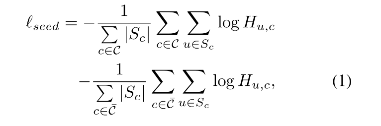
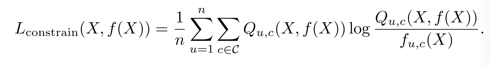
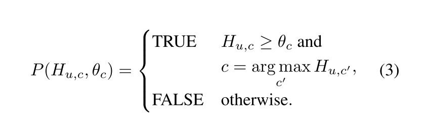
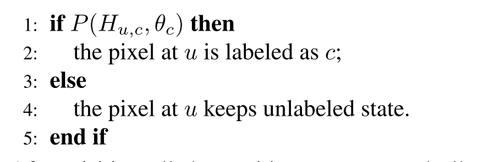

[TOC]

# Weakly-Supervised Semantic Segmantation Network with Deep Seeded Region Growing

## 问题/启发/注意点

1. 概率阈值时硬间隔的，没有为每类设置不同的阈值。
2. 相比传统SRG可以减少过分割（深度特征具有高级语义信息）
3. 生长+分割迭代

## 总结

## 摘要

图像级别的标注做语义分割，对于减轻人工标注有重要意义。最近针对此问题的最新方法首先使用深度分类网络推断每个对象类的稀疏和显著（有识别力的）区域。然后使用显著区域作为监督信息训练分割网络。受传统图像分割方法种子区域生长的启发，本文提出从显著性区域开始训练一个分割网络，然后通过种子生长方法逐渐地增加像素级的监督信息。

种子生长区域模块被整合在深度分割网络中，可以受益于深度特征。区别于传统具有固定/静态的标签的深度网络，本文提出的弱监督网络使用图片中的上下文信息来生成新的标签。

所提出的方法优于使用静态标签的弱监督分割网络，取得了SOTA，63.2% mIoU在PASCAL VOC 2012 test上，26.0%mIoU在COCO数据集上。

## 论文主要贡献

1. 在深度语义分割网络中，使用种子区域生长机制，使网络更安全地生成新的像素级别的标签来训练弱监督的语义分割网络。另外，网络可以端到端直接优化、容易训练
2. 弱监督语义分割SOTA，PASCAL VOC 2012 和COCO。mIoU61.4%，63.2%在PASCAL VOC valid set 和test set，接近于全监督的分割（67.6% 和 70.3%）

## 提出的方法

本节给出为弱监督语义分割提出的DSRG训练方法的细节。

首先，介绍如何从深度分类网络生成种子线索

然后，介绍一个平衡种子损失函数`seed loss function`，它使用种子线索作为监督信息来引导弱监督语义分割网络

最后，为了解决**种子线索小而稀疏**的问题提出DSRG训练

### 使用分类网络来种子生成

我们使用一个深度网络以image-level监督信息来定位显著性区域作为种子线索。image-level的标签没有明确提供任何关于语义目标的位置信息。但是最近，通过在图像级标签的监督下学习分类网络，可以获得指示判别对象区域的高质量种子。分类网络是全卷积的，判别行目标区域的位置在网络的深层layer中保留。

在本文的框架中，我们使用**CAMs**方法来定位前景类别。步骤如下简要描述。

使用修改的VGG-16来初始化分类网络。在网络中，全局平均池化应用在conv7；生成的张量作为图像的表示并使用FC层分类；最后全连接分类器使用conv7生成每一个目标类的热力图。然后在热力图上使用硬阈值来获取可辨别目标区域。

除了在前景中有种子线索，在背景中也存在了种子线索。为了定位背景，我们使用**显著性检测技术**（未读），然后在标准化的显著性图中简单地选择区域，该区域的像素作为背景具有低的显著性值。前景和背景中的种子线索叠成一个通道的分割图（segmentation mask）

### 种子损失（seeding loss）

在获取种子线索后，我们来介绍如何使用种子线索来训练一个语义分割网络。提出平衡的种子损失目的是促进分割网络的预测仅匹配分类网络提供的种子线索，同时忽略图片中的其他部分。考虑前景和背景的种子线索分布是不平衡的，对前景和背景平衡种子损失分别具有两个标准化系数。

$$C$$表示图像中的类别集合（不包括背景），$$\bar C$$表示背景。假设$$S_{c}$$是被分为类别$$c$$的位置集合。平衡的种子损失$$l_{seed}$$定义如下：

其中$$H_{u,c}$$表示分割图$$H$$在位置$$u$$类别为$$c$$的概率

另外，本文使用了一个边界损失（$$l_{boundary}$$）（Seed, expand and con- strain: Three principles for weakly-supervised image seg- mentation.提出）来促进分割与目标边界匹配。最终分割网络优化的损失函数为$$l=l_{seed}+l_{boundary}$$.

>$$l_{boundary}$$:引用自"Seed, expand and con- strain: Three principles for weakly-supervised image seg- mentation"和"Efficient inference in fully connected CRFs with gaus- sian edge potentials."
>
>名词注意：constrain-to-boundary loss — $$L_{constrain}$$ — $$L_{boundary}$$ 表示网络的输出和CRF的输出的平均KL散度
>
>

### 深度种子区域生长

在介绍的种子损失中，本文发现种子线索是**稀疏的**，在实践中，大约40%的像素具有标签。在训练过程中，训练深度网络传统的做法是固定标签。本文的想法是对为标记的像素进行种子线索生长。这样可以得到**更密集的监督信息**来训练更好的分割网络。**种子线索生长的基础是图片中具有同质的小区域，在这些区域像素应该具有相同的标签**。同质的小区域经常用于low-level视觉中，比如生成super-pixels。为了制定种子线索的生长问题，我们引用了一个经典算法，**种子区域生长（Seeding Region Growing）(SRG)**

在SRG中，一些种子像素是基于一些简单的手工规则（颜色，强度，纹理）来选择**初始化**的。一旦初始种子被放置，生长过程就开始寻找图片中同质的区域。比如，它试图将图像分割成这样的区域每个连通分量恰好包含一个初始种子的属性的区域。

我们提出整合SRG到深度分割网络中来做弱监督的语义分割。提出的方法定义为"深度种子区域生长"（DSRG）

当分类网络初始化了初始的种子后，根据**区域相似性准则**开始从种子点到未标记的点来生成区域。**区域相似性准则**定义为一个候选像素是否应该被合并到一个特定的区域。现在当执行基于区域生长的语义分割网络的训练时，必须要解决的问题是：应该采用哪一个相似度准则来描绘图像区域。接下来我们详细介绍处理这个问题的策略。

相似度准则$$P$$我们简单地使用分割网络生成的分割图$$H$$中的像素的概率阈值来表示：

> 

其中$$H_{u,c}$$表示位置$$u$$处的像素属于$$c$$类的概率。$$\theta$$时一个概率阈值。**在实践中，我们没有对不同的类别设置不同的阈值。**前景类别共享了一个阈值$$\theta_{f}$$，背景的阈值为$$\theta_{b}$$。传统的SRG经常由于低级图像的特征对于目标的类间外观不鲁棒而出现过分割的现象。在DSRG中，我们使用深度特征来计算像素相似度，深度特征是已经被证明具有高级语义信息的。因此，DSRG可以减少过分割并且不需要传统SRG的合并过程（合并过程未了解？？）。

现在我们可以使用分割图$H$和种子线索$S$作为执行区域生长的输入。DSRG对每一类是迭代访问的方式。我们定义类别$c$的访问过程为$V_{c}, c\in [0, |C|]$，其中c=0表示背景类。在$V_{c}$的一次迭代中，我们以行优先的方式（row-first）访问$S_{c}$所有的位置。当访问一个像素$Q$，我们定义像素$Q$的8邻居域未中标记的像素集合为$R$。对于$R_{u}\in R$它属于类别$c$的概率被定义为$H_{u,c}$。然后$R_{u}$基于$P$准则分类如下：

> 

在访问所有的位置后，我们添加所有新标记的像素到$S_{c}$。一旦$S_{c}$被改变我们将再次访问更新后的$S_{c}$。否则，$V_{c}$停止。终止准则与经典的SRG每一个像素都需要标记不同。因为在分割网络的低置信度的预测下很难说像素的标记。然而随着分割网络的容量增加，未标记像素的数量将会减少并且目标范围已经被正确的标记。另外，为了减少$V_{c}$的冗余访问，我们首先计算区域中的邻域是否满足公式3，然后邻域赋予初始种子相同的标记。这些邻域被选择作为新的指导来训练分割网络。我们定义$$|C|+1$$轮迭代过程为DSRG(S, H)，这是区域生长步骤。最后的更新$$S=[S_{0},…,S_{C}]$$被作为监督信息，应用到使用seeding loss的分割网络中。Fig 2中，DSRG(S, H)插入到所提出的分割网络中。

## 实验

Dataset：PASCAL VOC 2012 and COCO

metric：mIOU

Training/Testing Setting：

  VGG-16+DeepLab-ASPP

seed generation：

  热力图中值最大的前20%像素作为前景目标区域，使用显著性图来生成背景区域线索。我们采用标准化的显著性值0.06作为获取背景种子线索的阈值—像素的显著性值小于0.06被认为是背景（前景[14,33]；背景[12]）

相似度准则：

  $\theta_{b}=0.99, \theta_{f}=0.85$

CRF:

  Koltun的公开实现的默认设置（未读）

